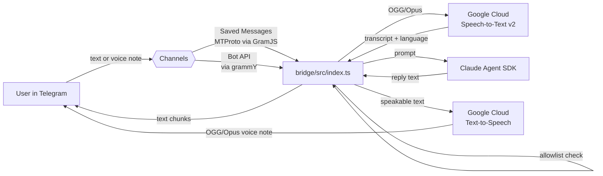

# telegram-bot

[](https://github.com/weirdapps/telegram-bot/actions/workflows/ci.yml)
[](https://github.com/weirdapps/telegram-bot/actions/workflows/codeql.yml)
[](https://github.com/weirdapps/telegram-bot/actions/workflows/sonarcloud.yml)
[](LICENSE)
[](https://nodejs.org/)
[](https://www.typescriptlang.org/)

A Telegram to Claude bridge in TypeScript. Send Claude a text or voice note from Telegram, get a text (and optionally spoken) reply back. Speech recognition and voice synthesis run through Google Cloud Speech-to-Text v2 and Google Cloud Text-to-Speech.

The repository ships two independently usable pieces:

- `bridge/` runs a long-lived process that forwards allowlisted Telegram messages to Claude via the official [Claude Agent SDK](https://www.npmjs.com/package/@anthropic-ai/claude-agent-sdk) and streams replies back.
- `src/` publishes the reusable `telegram-user-client` library and a `telegram-cli` / `tg` command for scripted Telegram automation (login, send text, send image, send file, listen for DMs).

Author: Dimitrios Plessas. License: MIT.

## How it works



A single FIFO queue serialises every Claude turn across both channels so concurrent messages never race. Session IDs are persisted so context survives bridge restarts. Voice replies mirror the language Speech-to-Text detected (Greek `el-GR` or English `en-US`), and markdown is stripped before synthesis so asterisks and hashes are never read aloud.

## Features

Grounded in the current code under `bridge/src/` and `src/`:

- Two input channels, either or both enabled at runtime:
  - **Saved Messages** via MTProto (`bridge/src/channels/mtprotoChannel.ts`), using a real Telegram user session captured by `telegram-cli login`. Ideal as a private command channel to yourself.
  - **Bot API** via `grammY` (`bridge/src/channels/botApiChannel.ts`), using a BotFather token. Enabled when `TELEGRAM_BOT_TOKEN` is set.
- Sender allowlist (`bridge/src/allowlist.ts`). Messages from user IDs outside `TELEGRAM_BRIDGE_ALLOWED_SENDER_IDS` are dropped and logged, never forwarded to Claude.
- Voice input via Google Cloud Speech-to-Text v2, model `long` in the `eu` multi-region, with automatic Greek/English detection (`bridge/src/stt/google.ts`).
- Voice output via Google Cloud Text-to-Speech, Chirp 3 HD voices per language (`bridge/src/tts/google.ts`). Output is native OGG/Opus, sent straight through Telegram's voice-note API with no transcoding.
- Reply routing policy (`bridge/src/replyRouter.ts`): `off`, `mirror` (voice reply only when the input was a voice note), or `always`. Long text is chunked into 4000-character Telegram messages (`bridge/src/splitMessage.ts`).
- Session persistence across restarts (`bridge/src/state.ts`, atomic write with `mode 0o600`).
- Loads the user's enabled Claude Code plugins from `~/.claude/settings.json` at startup with an optional `BRIDGE_PLUGIN_ALLOWLIST` / `BRIDGE_PLUGIN_DENYLIST` curated subset (`bridge/src/pluginLoader.ts`).
- Silence watchdog on the SDK stream (300 s) plus a one-shot retry with a fresh session (`bridge/src/claude.ts`, `bridge/src/claudeRetry.ts`).
- Best-effort auto-downgrade to Opus 4.6 on spurious model policy refusals (`bridge/src/claudeFallback.ts`).
- Orphan MCP-process reaper after every turn (`bridge/src/mcpReaper.ts`) so long-running bridges do not leak subprocesses.
- Standalone Telegram CLI (`telegram-cli` / `tg`) with `login`, `logout`, `send-text`, `send-image`, `send-file`, and `listen` (JSON-line stream) subcommands under `src/cli/commands/`.

## Prerequisites

- **Node.js 20** or newer (CI runs on Node 22). See `engines.node` in `package.json`.
- A Telegram **api_id** and **api_hash** from [my.telegram.org](https://my.telegram.org) under "API development tools" (required for the Saved Messages channel).
- A **Telegram Bot Token** from [@BotFather](https://t.me/BotFather) (only required for the Bot API channel).
- A **Google Cloud** project with the **Speech-to-Text** and **Text-to-Speech** APIs enabled, plus a service-account JSON key. Only required if you use the voice bridge.
- The **`claude` CLI** installed on the host and reachable on `$PATH`. The bridge invokes it via `@anthropic-ai/claude-agent-sdk`.

## Installation

```bash
git clone https://github.com/weirdapps/telegram-bot.git
cd telegram-bot
npm install
npm run link        # compiles TypeScript and globally links `telegram-cli` / `tg`
```

`npm run link` runs `npm link` under the hood, so `telegram-cli ...` and `tg ...` work from anywhere. Undo with `npm run unlink`. If you prefer not to link globally, use `npm run cli -- <subcommand>` in place of `telegram-cli <subcommand>`.

## Configuration

Copy `.env.example` to `.env` and fill in the values. Every variable is validated at startup; there are no silent fallbacks (`src/config/config.ts`, `bridge/src/voiceBridgeConfig.ts`).

### Core Telegram (always required)

| Variable                | Required for         | Description                                                               |
| ----------------------- | -------------------- | ------------------------------------------------------------------------- |
| `TELEGRAM_API_ID`       | Any MTProto usage    | Positive integer from my.telegram.org.                                    |
| `TELEGRAM_API_HASH`     | Any MTProto usage    | 32-char hex from my.telegram.org. Treat as a secret.                      |
| `TELEGRAM_PHONE_NUMBER` | `telegram-cli login` | Your phone number in international format with leading `+`.               |
| `TELEGRAM_SESSION_PATH` | Any MTProto usage    | Absolute path where the serialised StringSession is stored. Written 0600. |
| `TELEGRAM_DOWNLOAD_DIR` | Any MTProto usage    | Absolute directory for incoming photo / voice / audio downloads.          |
| `TELEGRAM_LOG_LEVEL`    | Any usage            | `trace`, `debug`, `info`, `warn`, `error`, or `silent`.                   |

### Bridge (only when running `npm run bridge`)

| Variable                                 | Description                                                                                          |
| ---------------------------------------- | ---------------------------------------------------------------------------------------------------- |
| `TELEGRAM_BRIDGE_ALLOWED_SENDER_IDS`     | Comma-separated numeric Telegram user IDs allowed to talk to the bridge. Everyone else is dropped.   |
| `TELEGRAM_BOT_TOKEN`                     | Optional. When set, enables the Bot API channel alongside Saved Messages.                            |
| `TELEGRAM_BRIDGE_BOT_TMPDIR`             | Optional. Where Bot API voice files are staged. Default `$HOME/.telegram/bot-inbox`.                 |
| `TELEGRAM_BRIDGE_DISABLE_SAVED_MESSAGES` | Set to `true` to run bot-only (no MTProto login required). At least one channel must remain enabled. |
| `TELEGRAM_BRIDGE_STATE_PATH`             | Optional. Path to the Claude session-state JSON. Default `$HOME/.telegram/claude-bridge.state.json`. |
| `TELEGRAM_BRIDGE_CWD`                    | Optional. Working directory the bridge passes to Claude (bounds file access). Default `$HOME`.       |
| `BRIDGE_PLUGIN_ALLOWLIST`                | Optional. Comma-separated `name@marketplace` keys to load. When set, only these plugins are enabled. |
| `BRIDGE_PLUGIN_DENYLIST`                 | Optional. Comma-separated `name@marketplace` keys to skip.                                           |

### Voice (only when the bridge should transcribe or speak)

| Variable                         | Description                                                                      |
| -------------------------------- | -------------------------------------------------------------------------------- |
| `GOOGLE_CLOUD_PROJECT`           | GCP project ID for Speech / TTS billing.                                         |
| `GOOGLE_APPLICATION_CREDENTIALS` | Absolute path to a GCP service-account JSON key with Speech and TTS permissions. |

Voice-tuning variables (`voiceConfig`, `maxAudioSeconds`, `rejectInboundAboveSeconds`, `keepAudioFiles`, and the language-specific TTS voice names) are documented in `bridge/src/voiceBridgeConfig.ts` and shown with example values in `.env.example`.

### Claude provider (bridge only)

The bridge inherits `ANTHROPIC_MODEL`, `CLOUD_ML_REGION`, `CLAUDE_CODE_USE_VERTEX`, `ANTHROPIC_VERTEX_PROJECT_ID`, and any `VERTEX_MODEL_FALLBACK*` / `VERTEX_REGION_CLAUDE_*` variables via `dotenv`. The fallback path in `bridge/src/claudeFallback.ts` uses them to retry a refused turn on a different model or region without touching `process.env`.

## Usage

### 1. Log in to Telegram (Saved Messages channel only)

```bash
telegram-cli login
```

Prompts for the SMS/Telegram code and optional 2FA password, then writes the session to `TELEGRAM_SESSION_PATH` with mode 0600. Only needed once per machine. Skip this step if you plan to run bot-only (`TELEGRAM_BRIDGE_DISABLE_SAVED_MESSAGES=true`).

### 2. Start the bridge

```bash
npm run bridge
```

The process opens all configured channels, logs `bridge listening (text + voice)`, and waits. Send a message to your Saved Messages (or DM the bot) and Claude replies.

### 3. Telegram slash commands

Handled inline in the bridge, never forwarded to Claude:

| Command                        | Behaviour                                                               |
| ------------------------------ | ----------------------------------------------------------------------- |
| `/clear`                       | Reset the Claude session. The next message starts a fresh conversation. |
| `/status`                      | Print current session ID, last message timestamp, and voice mode.       |
| `/voice [mirror\|always\|off]` | Change the voice-reply policy. Persisted alongside the session.         |
| `/help`                        | List available commands.                                                |

Voice modes:

- `off`: text replies only, no synthesis.
- `mirror` (default): voice reply when the input was a voice note, otherwise text only.
- `always`: always reply with a voice note, regardless of input modality.

## Standalone Telegram CLI

The same package ships a scriptable CLI for sending and receiving Telegram messages without the bridge.

```bash
telegram-cli <subcommand> [flags]
# or the shorter alias
tg <subcommand> [flags]
```

| Subcommand   | Flags                                          | Behaviour                                                                                                        |
| ------------ | ---------------------------------------------- | ---------------------------------------------------------------------------------------------------------------- |
| `login`      | `[--force]`                                    | Interactive login; persists session to `TELEGRAM_SESSION_PATH`. `--force` overwrites an existing session file.   |
| `logout`     | (none)                                         | Invalidates the session server-side and deletes the local file.                                                  |
| `send-text`  | `--to <peer> --text <string>`                  | Send a plain-text DM.                                                                                            |
| `send-image` | `--to <peer> --file <path> [--caption <text>]` | Send an image as a Telegram photo.                                                                               |
| `send-file`  | `--to <peer> --file <path> [--caption <text>]` | Send an arbitrary file as a document.                                                                            |
| `listen`     | (none)                                         | Open a persistent MTProto connection; write one JSON line per incoming DM to stdout; download media attachments. |

Accepted `--to` peer formats:

- `@username`, for example `@alice`
- International phone, for example `+306900000000`
- Numeric Telegram user ID, for example `123456789`

## Library usage

`src/index.ts` re-exports the public surface. Consume it directly from TypeScript or JavaScript:

```typescript
import { TelegramUserClient, loadConfig, createLogger } from 'telegram-user-client';

const cfg = loadConfig();
const logger = createLogger(cfg.logLevel);

const client = new TelegramUserClient({
  apiId: cfg.apiId,
  apiHash: cfg.apiHash,
  sessionString: '', // paste a stored session, or run login() first
  logger,
  downloadDir: cfg.downloadDir,
  sessionPath: cfg.sessionPath,
});

await client.connect();
await client.sendText('@alice', 'Hello from the library.');

client.on('any', (m) => {
  console.log('incoming:', m.kind, m.text);
});
client.startListening();
```

Also exported: `resolvePeer`, `classifyIncoming`, `downloadIncomingMedia`, `withFloodRetry`, `installGracefulShutdown`, the typed error classes (`ConfigError`, `PeerNotFoundError`, `UnsupportedMediaError`, `LoginRequiredError`), and GramJS's `FloodWaitError`.

## Architecture

```text
telegram-bot/
├── src/                              # `telegram-user-client` library + CLI
│   ├── cli/                          # `telegram-cli` / `tg` (commander)
│   ├── client/                       # GramJS wrapper: connect, listen, send
│   ├── config/                       # dotenv + Zod validation
│   ├── logger/                       # pino logger factory
│   ├── errors.ts                     # typed error surface
│   └── index.ts                      # public barrel
└── bridge/                           # long-lived Claude bridge process
    ├── src/
    │   ├── index.ts                  # entry: channels, FIFO queue, signals
    │   ├── channels/                 # Saved Messages (MTProto) + Bot API (grammY)
    │   ├── claude.ts                 # Claude Agent SDK wrapper + silence watchdog
    │   ├── claudeRetry.ts            # one-shot retry with fresh session
    │   ├── claudeFallback.ts         # Opus 4.8 to 4.6 refusal downgrade
    │   ├── allowlist.ts              # sender-ID filter
    │   ├── stt/google.ts             # Google Speech-to-Text v2 (el-GR / en-US)
    │   ├── tts/google.ts             # Google Text-to-Speech (Chirp 3 HD, OGG/Opus)
    │   ├── replyRouter.ts            # pure text-vs-voice routing decision
    │   ├── splitMessage.ts           # 4000-char Telegram chunking
    │   ├── markdownStrip.ts          # strip markdown before TTS
    │   ├── voiceMode.ts              # `/voice` command handling
    │   ├── voiceBridgeConfig.ts      # voice env-var validation
    │   ├── pluginLoader.ts           # Claude Code plugin discovery
    │   ├── mcpReaper.ts              # orphan MCP-process reaper
    │   ├── permissions.ts            # user-editable tool policy
    │   └── state.ts                  # atomic session persistence
    └── launchd/                      # macOS LaunchAgent template + wrapper
```

## Development

```bash
npm run typecheck    # tsc --noEmit
npm run lint         # ESLint (flat config)
npm run format       # Prettier
npm test             # Vitest, run once
npm run coverage     # Vitest + v8 coverage report
npm run build        # compile to dist/
npm run dev          # tsx src/cli/index.ts (hot CLI)
npm run bridge       # tsx bridge/src/index.ts (foreground bridge)
```

CI is defined in `.github/workflows/`:

- `ci.yml` runs typecheck, lint, build, and test on every push and PR to `master` (Node 22).
- `codeql.yml` runs GitHub's JavaScript/TypeScript CodeQL analysis on push, PR, and weekly.
- `sonarcloud.yml` uploads coverage to SonarCloud on push and PR when `SONAR_TOKEN` is configured.
- `dependabot-auto-merge.yml` and `deps-refresh.yml` keep dependencies current; grouping and schedule are defined in `.github/dependabot.yml`.

## Deployment: macOS LaunchAgent

`bridge/launchd/` ships a plist template and a zsh wrapper that loads your login profile (needed so `fnm` or `nvm` can put Node on `$PATH`). Generate a local plist by substituting your real `$HOME`:

```bash
chmod +x ~/SourceCode/telegram-bot/bridge/launchd/run.sh

sed "s|__HOME__|$HOME|g" \
  ~/SourceCode/telegram-bot/bridge/launchd/com.weirdapps.telegram-claude-bridge.plist.template \
  > ~/Library/LaunchAgents/com.weirdapps.telegram-claude-bridge.plist

launchctl bootstrap gui/$UID \
  ~/Library/LaunchAgents/com.weirdapps.telegram-claude-bridge.plist
```

`KeepAlive` is `true` so launchd restarts the bridge on any exit; `ThrottleInterval` is 10 s to bound restart loops. Logs land at `~/Library/Logs/telegram-claude-bridge.{out,err}.log`. Rename the `com.weirdapps.*` prefix to your own reverse-DNS handle if you fork.

## Security

- The `StringSession` file at `TELEGRAM_SESSION_PATH` is equivalent to your Telegram password. Anyone with it can act as your account. The library writes it with mode `0o600` (owner-only); `.gitignore` excludes `*.session` and `*.session.txt`. Do not commit it, and do not share it.
- `TELEGRAM_BRIDGE_ALLOWED_SENDER_IDS` is the bridge's primary access control. Any message from a sender ID not on the list is dropped before any Claude call is made.
- `GOOGLE_APPLICATION_CREDENTIALS` is passed explicitly to the STT and TTS constructors so it stays out of `process.env` where the Anthropic Vertex SDK would otherwise pick it up and break Claude authentication.
- Coordinated vulnerability disclosure: see [SECURITY.md](SECURITY.md).

## License

[MIT](LICENSE) (c) 2026 Dimitris Plessas.
